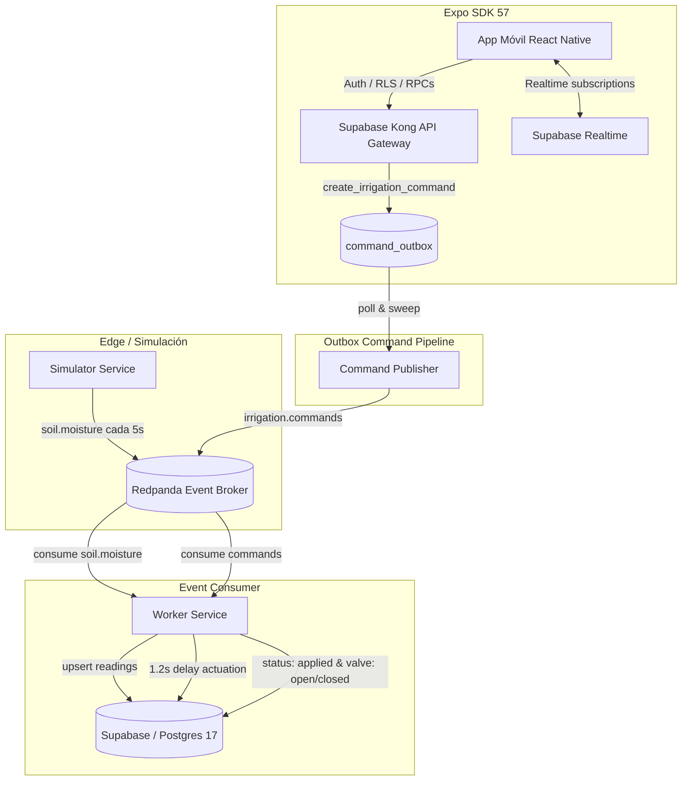

# AgroPulse 🌾

AgroPulse es un sistema de agricultura de precisión impulsado por eventos (Event-Driven Architecture) con soporte multi-inquilino (multi-tenant), mapas geoespaciales con PostGIS, telemetría de suelo en tiempo real, pipeline de comandos transaccionales (Transactional Outbox Pattern) y aplicación móvil desarrollada en Expo SDK 57 / React Native.

> **Aviso de datos académicos:** Todas las coordenadas GPS, lecturas de humedad, organizaciones, usuarios, datos de sensores y semillas utilizadas por este proyecto son ficticias y están destinadas exclusivamente a fines de evaluación académica y demostraciones.

---

## 🏗️ Arquitectura del Sistema



---

## 🚀 Guía de Inicio Rápido

### 1. Prerrequisitos
- Node.js 20+ y npm
- Docker Desktop
- Expo Go instalado en dispositivo móvil o emulador

### 2. Configuración de Entorno
```bash
# Variables del backend y servicios
copy .env.example .env

# Variables públicas de la app móvil
copy apps\agropulse\.env.example apps\agropulse\.env.local

# Instalación de dependencias y compilación
npm install
npm run build
npm run typecheck
```

### 3. Levantar Infraestructura
```bash
# Iniciar Redpanda (Kafka API en localhost:19092)
npm run infra:up

# Iniciar Supabase local (PostgreSQL 17 + PostGIS + Auth + Kong)
npm run supabase:start

# Recrear esquema y cargar semillas agronómicas
npm run supabase:reset

# Inicializar los 4 usuarios de prueba con sus roles
npm run bootstrap:users
```

### 4. Iniciar Servicios en Segundo Plano
En terminales separadas (o ejecutados concurrentemente):
```bash
# 1. Trabajador consumidor de telemetría y actuador de válvulas
npm run start:worker

# 2. Publicador de outbox transaccional
npm run start:command-publisher

# 3. Simulador de telemetría de sensores
npm run start:simulator
```

### 5. Iniciar la App Móvil
```bash
npm run start:app
```
Escanee el código QR con la app **Expo Go** en su iPhone o presione `w` para abrir en navegador.

---

## 👥 Cuentas de Demostración (1-Tap Login)

La pantalla de login incluye botones de acceso rápido para probar inmediatamente los distintos roles y organizaciones sin necesidad de tipear credenciales:

| Persona | Email | Contraseña | Organización(es) | Rol / Permisos |
|---|---|---|---|---|
| **Productor Principal** | `producer@agropulse.test` | `AgroPulse2026!` | Establecimiento AgroPulse & Finca Aislada | Control total: válvulas y edición de umbrales |
| **Operador de Riego** | `operator@agropulse.test` | `AgroPulse2026!` | Establecimiento AgroPulse | Operación de válvulas (apertura/cierre). No edita umbrales |
| **Asesor Técnico** | `advisor@agropulse.test` | `AgroPulse2026!` | Establecimiento AgroPulse | Solo lectura: monitoreo agronómico y gráficos |
| **Productor Aislado** | `productor2@agropulse.test` | `AgroPulse2026!` | Finca Aislada | Aislamiento multi-tenant estricto por RLS |

---

## 🧪 Pruebas Automatizadas

El proyecto cuenta con suites automatizadas que validan la totalidad de las reglas de negocio y seguridad:

```bash
# 1. Pruebas unitarias de contratos de dominio y validaciones (18/18 tests)
npm run test:contracts

# 2. Pruebas de base de datos con pgTAP (50/50 tests)
npm run supabase:test

# 3. Verificación de tipos TypeScript estricto en todos los paquetes
npm run typecheck
```

---

## 📱 Pantallas de la Aplicación

1. **🌾 Lotes (`/`):**
   - Listado de lotes con semáforo agronómico (`optimal`, `dry`, `wet`, `stale`).
   - Barra de nivel de humedad en tiempo real con indicador de antigüedad de lectura.
   - Selector multi-establecimiento para alternar entre organizaciones.
2. **🗺️ Mapa (`/map`):**
   - Polígonos de lotes georreferenciados sobre el mapa con codificación por color según su estado hídrico.
   - Ubicación GPS del usuario y verificación geoespacial en tiempo real con PostGIS (`is_point_inside_plot`).
3. **🔔 Alertas (`/alerts`):**
   - Detección de estrés hídrico (`low_moisture`) y desconexión de estaciones (`station_stale`).
   - Filtros de estado y resolución interactiva de alertas.
4. **📊 Diagnóstico (`/diagnosis`):**
   - Medición de latencia de telemetría y salud de conectividad Supabase / Redpanda.
   - Auditoría de identidad: User UID, rol activo y conteo de entidades por inquilino.
5. **👤 Cuenta (`/account`):**
   - Selector interactivo de organizaciones.
   - Resumen de permisos asignados al rol activo.
   - Cierre de sesión seguro.
6. **📈 Detalle de Lote (`/plot/[id]`):**
   - Gráfico SVG de evolución de humedad (últimas 6 horas) con franja sombreada de régimen óptimo.
   - Editor de umbrales de humedad (restringido al rol Productor mediante RPC `update_plot_thresholds`).
   - Control de válvulas con modal de duración (15, 30, 60 min).
   - Pipeline de comando con feedback visual en vivo (`pending` → `applied` en ~1.6s).
   - Cancelación de comandos pendientes (`cancel_irrigation_command`).

---

## 📂 Estructura del Repositorio

| Directorio | Propósito |
|---|---|
| `apps/agropulse` | Aplicación móvil Expo SDK 57 / Expo Router / React Native |
| `packages/contracts` | Contratos TypeScript compartidos, tipos y validadores de dominio |
| `services/simulator` | Proceso productor de telemetría hacia Redpanda |
| `services/worker` | Consumidor de eventos, persistencia en Supabase y actuador |
| `services/command-publisher` | Publicador de outbox transaccional con sweeper de deadlines |
| `supabase/migrations` | Migraciones SQL versionadas (Postgres 17 + PostGIS + RLS + RPCs) |
| `supabase/seed` | Datos de prueba agronómicos iniciales |
| `supabase/tests` | Suite de pruebas de regresión pgTAP |
| `infra` | Docker Compose de Redpanda |
