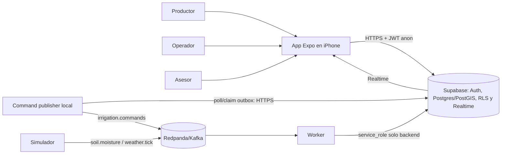
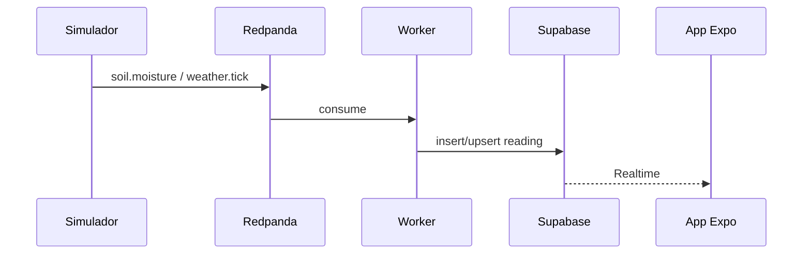

# Arquitectura objetivo de AgroPulse

AgroPulse se implementará como un sistema distribuido académico: una app Expo consulta y opera sobre Supabase, mientras que Redpanda, el simulador y el worker permanecen del lado backend. Supabase es la fuente de verdad; Realtime propaga cambios persistidos hacia el teléfono y nunca reemplaza el modelo de datos.

## 1. Alcance arquitectónico

### Incluido

- App móvil para iOS, ejecutada en un iPhone físico mediante Expo Go SDK 57.
- Supabase Auth, Postgres, RLS, Realtime y PostGIS.
- Redpanda/Kafka para telemetría y, como Should fundamental, comandos de riego.
- Simulador de sensores y worker en Node.js + TypeScript.
- Datos semilla reproducibles, observabilidad mínima y pruebas de las reglas críticas.

### Fuera de alcance

- Hardware, LoRa, CAN bus, drones o NDVI real.
- Cliente Kafka/MQTT en la app móvil.
- Edición de polígonos (RF-07), lectura manual/offline (RF-21 y RNF-07), comentarios del asesor, campañas agrícolas y sugerencia RF-22 en la primera entrega.
- Pagos, marketplace, contabilidad, multi-país, facturación e IA agronómica.
- Uso productivo: humedad, clima y coordenadas son datos ficticios con intención didáctica.

## 2. Contexto del sistema



## 3. Contenedores y responsabilidades

| Contenedor | Responsabilidad | Datos/credenciales permitidos |
|---|---|---|
| `apps/agropulse` | UI, navegación, GPS, visualización de mapa/gráfico, sesión, comandos y estados de error | `anon key`, JWT del usuario; nunca `service_role` ni credenciales Kafka |
| Supabase Auth | Login/logout y sesión persistente | Identidades de usuarios |
| Supabase Postgres/PostGIS | Fuente de verdad, geometrías, reglas, restricciones e idempotencia | Datos de dominio persistentes |
| Supabase RLS | Perímetro por organización y autorización por rol | Claims/JWT y memberships |
| Supabase Realtime | Notificación de cambios ya persistidos | `readings`, `valves`, `irrigation_commands`, `alerts` |
| `services/command-publisher` | Reclama filas del outbox durable, publica `irrigation.commands` y registra la publicación | URL de Supabase, `service_role` backend y credencial del broker, solo en env ignorado |
| Redpanda | Bus de telemetría y comandos backend | Topics; inaccesible para el móvil |
| `services/simulator` | Genera ticks cada 3-8 s y permite apagar una estación | IDs UUID de estaciones semilla |
| `services/worker` | Consume eventos, valida contratos, persiste lecturas, aplica comandos y registra logs | `service_role` únicamente en entorno backend |
| `packages/contracts` | Tipos y validaciones compartidos entre servicios | Contratos de eventos, sin secretos |

## 4. Flujos principales

### 4.1 Telemetría

1. El simulador genera un tick con timestamp ISO-8601 UTC y `station_id` UUID.
2. Publica `soil.moisture`; `weather.tick` completa la lluvia cuando corresponda. `valve.status` queda fuera del alcance inicial: el worker actualiza Supabase directamente.
3. El worker consume, valida y descarta con log los IDs inexistentes sin detener el loop.
4. El worker inserta o actualiza la lectura en Supabase.
5. Realtime notifica a la app.
6. La app actualiza detalle, gráfico, antigüedad y semáforo en menos de 3 s.



### 4.2 Comando de riego

El contrato Must es `pending -> applied | failed`. `irrigation.commands`, aunque Should en el PRD, se promueve deliberadamente como dependencia habilitante del mismo slice de comandos porque el usuario lo seleccionó como fundamental y la arquitectura final depende de él. Los demás Should permanecen después del hardening Must.

1. La app invoca una RPC acotada con acción, duración y `client_request_id` UUID; la función deriva `requested_by` de `auth.uid()`.
2. Postgres valida rol, duración 1-120, idempotencia y ausencia de otro `pending` para la válvula.
3. La misma transacción inserta `irrigation_commands.status = pending` y una fila en un outbox durable; no existe un estado donde haya comando sin intención de publicación.
4. `services/command-publisher`, ejecutado en Docker Compose, consulta el Supabase hospedado por HTTPS, reclama filas no publicadas mediante lease/claim atómico y publica `irrigation.commands` en el Redpanda local.
5. La aceptación RPC fija `accepted_at` y `dispatch_deadline_at = accepted_at + 1 s`. Tras el acuse del broker, el publisher registra `published_at`; ante error reintenta con backoff acotado mientras quede presupuesto.
6. Si no completa la publicación antes de `dispatch_deadline_at`, el sweeper de deadlines del publisher invoca una operación atómica que hace compare-and-set `pending -> failed`, guarda `failure_reason = dispatch_timeout` y cierra/expira la fila de outbox. El servicio tiene healthcheck/restart en Compose; un evento tardío no puede revivir el comando.
7. La entrega es al menos una vez, por lo que pueden existir duplicados. El worker consume, simula 1-2 s en el camino con broker y aplica por `command_id`/`client_request_id` de forma idempotente. Una operación backend atómica actualiza válvula y comando solo si aún está `pending`; duplicados y eventos tardíos se ignoran por CAS/deduplicación.
8. En éxito termina `applied`; en fallo controlado termina `failed` con `valve_timeout` sin cambiar incorrectamente la válvula.
9. Realtime actualiza la app sin reinicio.

El objetivo interno, medido desde la aceptación RPC hasta el estado terminal renderizado, es: aceptación + dispatch + aplicación simulada <= 3,5 s; Realtime/render <= 1 s; margen >= 0,5 s antes del límite RF-15 de 5 s. Los reintentos se observan en diagnóstico; un intento fallido no se oculta como éxito ni habilita una segunda aplicación.

La base sigue siendo la autoridad: un evento duplicado no puede aplicar dos veces el mismo comando, y el estado persistido decide si el worker debe actuar.

### 4.3 Cancelación

- Solo se cancela un comando todavía `pending` mediante una RPC acotada.
- La cancelación y la aplicación compiten con compare-and-set sobre `status = pending`; exactamente una transición gana.
- Productor u operador pueden cancelar. El worker ignora un evento cuyo comando ya no está `pending`.

## 5. Modelo de datos y reglas

El esquema mínimo conserva los nombres en inglés definidos por el PRD: `organizations`, `memberships`, `plots`, `stations`, `readings`, `valves`, `irrigation_commands` y `alerts`.

Reglas que deben imponerse en backend:

- `memberships` define pertenencia y rol `producer | operator | advisor`.
- `client_request_id` es único para hacer idempotente la solicitud.
- Un índice único parcial impide más de un comando `pending` por válvula.
- El outbox referencia al comando, registra intentos, `available_at`, lease/claim y `published_at`; se escribe en la misma transacción que el comando.
- `duration_min` se restringe a 1-120 cuando aplica.
- Las transiciones de estado admitidas se controlan con restricciones o funciones SQL.
- El cliente no puede insertar/actualizar directamente válvulas ni campos protegidos de comandos (`requested_by`, `status`, `applied_at`, resultado). RPCs acotadas crean/cancelan; el worker aplica mediante función backend atómica.
- Índice `(station_id, measured_at DESC)` para recuperar la lectura más reciente y la serie temporal.
- El worker puede aplicar retención de lecturas mayores a 48 h en el entorno académico.

## 6. Seguridad y límites de confianza

| Límite | Regla |
|---|---|
| iPhone -> Supabase | Usa TLS, `anon key` y JWT de usuario. La UI no constituye autorización. |
| Usuario -> organización | RLS exige una membership para consultar datos relacionados con esa organización. |
| Roles humanos | Solo productor edita umbrales; productor y operador crean/cancelan comandos; asesor solo consulta. Sus comentarios quedan diferidos. |
| Backend -> Supabase | `service_role` se limita al worker, command-publisher y bootstrap; solo se carga desde variables ignoradas por Git. |
| Backend -> Redpanda | Solo publicador, simulador y worker acceden al broker. |
| Realtime | Replica cambios que el usuario puede leer según RLS; no concede permisos adicionales. |

La semilla incluirá una segunda organización. El productor principal pertenecerá a ambas para hacer visible RF-03; `productor2@agropulse.test` pertenecerá exclusivamente a la segunda para demostrar RF-02 sin acceso a los lotes principales. Los usuarios de Auth se crearán mediante un script local de bootstrap; los secretos reales no se versionarán.

## 7. Geoespacial y GPS

- `plots.geom` utilizará PostGIS con un SRID documentado (recomendado: WGS84/SRID 4326).
- `react-native-maps` dibuja los polígonos y `expo-location` obtiene la ubicación.
- La app puede dar respuesta inmediata, pero la comprobación autoritativa de punto dentro del polígono se ejecuta en PostGIS.
- Si el usuario niega permisos o no hay ubicación, se informa `ubicación no disponible` y la app continúa funcionando.

## 8. Estado derivado del lote

Una vista SQL calculará `plot_status` con la primera condición coincidente:

1. `stale`: no existe lectura o su antigüedad supera 15 min.
2. `dry`: `moisture_pct < threshold_min`.
3. `optimal`: `threshold_min <= moisture_pct <= threshold_max`.
4. `wet`: `moisture_pct > threshold_max`.

Los valores por defecto son 25 y 45. La app refrescará periódicamente la consulta además de escuchar Realtime, porque el paso a `stale` ocurre por el transcurso del tiempo y no necesariamente produce una nueva fila.

## 9. Topología local y nube

### Desarrollo y pruebas integrales

- Docker Desktop levanta Redpanda, command-publisher, worker y simulador desde `infra/docker-compose.yml`.
- Supabase CLI proporciona un entorno local reproducible para migraciones y pgTAP.
- La app Expo corre en Windows y se abre por Expo Go en el iPhone físico dentro de la misma red.

### Defensa

- App Expo Go SDK 57 en iPhone físico.
- Proyecto Supabase hospedado con migraciones y semilla equivalentes al entorno local.
- Redpanda, command-publisher, worker y simulador se ejecutan en Docker Desktop. Publisher y worker alcanzan el Supabase hospedado por HTTPS; los secretos se inyectan desde un env local ignorado.
- La consola de Compose conserva evidencia `produced / consumed / upsert reading`.

## 10. Estructura del monorepo

```text
apps/agropulse/       # App Expo
services/worker/      # Consumers y aplicación de comandos
services/simulator/   # Productor de telemetría
services/command-publisher/ # Outbox de comandos hacia Redpanda
packages/contracts/   # Tipos y validaciones compartidas
supabase/migrations/  # Esquema, PostGIS, RLS, funciones y Realtime
supabase/seed/        # Datos de demostración
infra/                # Docker Compose y Redpanda
docs/                 # Arquitectura, requisitos, decisiones e informe
```

La raíz usará npm workspaces para compartir contratos sin agregar otro gestor de paquetes.

## 11. Datos semilla y Happy Path

- Organización principal: `Estancia Didáctica Concordia`.
- Lotes: `Costa 1` óptimo, `Costa 2` seco y `Monte A` stale.
- Al menos una estación y una válvula por lote. Cada lote demostrable conserva 12 o más lecturas dentro de las últimas 6 h; en Monte A la lectura más reciente tiene más de 15 min para que el lote sea stale sin perder la serie histórica.
- Usuarios: productor principal miembro de ambas organizaciones, operador y asesor de la organización principal; `productor2@agropulse.test` pertenece exclusivamente a la segunda.
- Happy Path: login -> mapa -> Costa 2 al 18 % con mínimo 25 % -> abrir 30 min -> `pending` -> `applied` en hasta 5 s -> válvula y mapa actualizados.

## 12. Criterios arquitectónicos de aceptación

- [ ] La app no contiene cliente Kafka ni `service_role`.
- [ ] RLS bloquea lecturas entre organizaciones y comandos del asesor.
- [ ] Solo el productor puede editar umbrales; productor y operador pueden crear/cancelar comandos mediante RPC.
- [ ] Postgres impide duplicados por `client_request_id` y dos `pending` en la misma válvula.
- [ ] Escritura de comando y outbox es atómica; el publisher reclama con lease, reintenta con backoff y tolera entrega duplicada.
- [ ] El deadline de dispatch produce `failed/dispatch_timeout`, expira el outbox y los eventos tardíos no modifican el estado.
- [ ] Aplicación y cancelación usan compare-and-set; una carrera tiene exactamente un ganador.
- [ ] Los cambios persisten antes de notificarse por Realtime.
- [ ] El estado `stale` aparece aunque no llegue un nuevo evento.
- [ ] Un ID de estación inválido se registra y descarta sin caer el worker.
- [ ] El flujo H1 se completa en menos de 5 s y RF-16 se demuestra de forma repetible.
